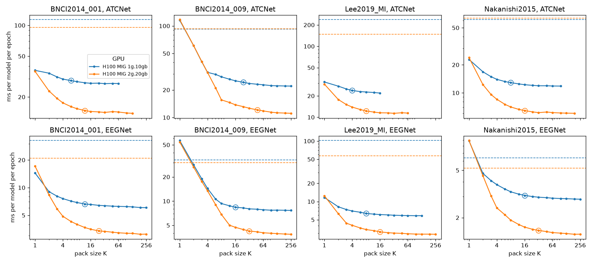
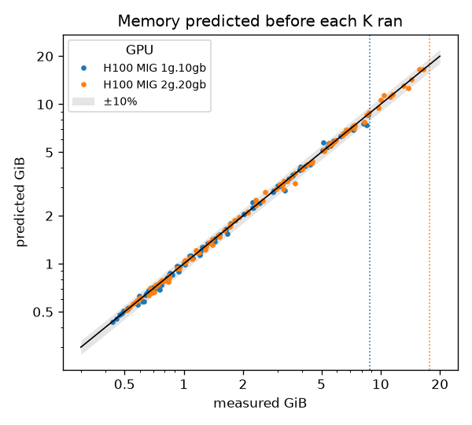

# brainfold

Train every fold, seed and subject of an EEG decoding benchmark at once.

EEG decoding models are small and EEG datasets are small, so training one
model at a time leaves most of a GPU idle. Results also vary a lot across
seeds, folds and subjects, so one run says little. A careful evaluation
(seeds x folds x subjects) means hundreds of runs.

brainfold packs K such runs into one network and trains them together:

- **Exact.** Each member computes what a separate braindecode model would.
  The tests check forward passes, BatchNorm running statistics and Adam
  training steps against K separate models in float64.
- **Fast.** 4-8x less training time per model on a GPU (see
  [Benchmarks](#benchmarks)), partly from packing and partly from computing
  each model's first block in a cheaper order.
- **braindecode-compatible.** Packed models take braindecode's arguments, and
  each member converts to and from an ordinary braindecode model, for
  evaluation, saving and the Hugging Face Hub.

The goal is to make thorough evaluation cheap: report the spread over seeds
and folds instead of a single number, for about the cost of one run.

## Models

| model | class | braindecode | speedup at K=18 (RTX 4080 SUPER) |
|---|---|---|---|
| EEGNet (Lawhern et al., 2018) | `PackedEEGNet` | >= 1.2 | 4.3-7.1x |
| ATCNet (Altaheri et al., 2022) | `PackedATCNet` | >= 1.4 | 7.6-7.8x |

More models will follow; see [Adding a model](#adding-a-model).

## Install

```bash
pip install "brainfold @ git+https://github.com/Drew-Wagner/brainfold"
```

The package depends only on PyTorch. Extras: `[braindecode]` for
`to_braindecode()` and `from_braindecode()`, `[recipes]` for the recipes.

For development:

```bash
uv sync --group dev --extra braindecode --extra recipes
uv run pytest
```

## Quickstart

```python
import torch
import torch.nn.functional as F
from brainfold import PackedEEGNet

model = PackedEEGNet.from_seeds(seeds, n_chans=22, n_outputs=4, n_times=512).cuda()
optimizer = torch.optim.Adam(model.parameters(), lr=1e-3)

for x, y in batches:  # x: (batch, K, n_chans, n_times), y: (batch, K); column k is member k's batch
    logits = model(x)  # (batch, K, n_outputs)
    losses = F.cross_entropy(logits.permute(0, 2, 1), y, reduction="none").mean(0)  # (K,)
    optimizer.zero_grad()
    losses.sum().backward()  # SUM, not mean: each member gets exactly its own gradient
    optimizer.step()         # one Adam over the packed parameters == K separate Adams
```

The loop is the same for every model. Each member sees its own data, so the K
columns can hold different folds, subjects or seeds. Not every training trick
keeps the members independent: see
[Keeping members independent](#keeping-members-independent). The
[recipes](#recipes) have a complete loop with per-member shuffling, a cosine
schedule, evaluation and a baseline.

## Common interface

Every packed model has the same interface:

- **Construction.** `PackedX(K, **kwargs)` is K braindecode `X(**kwargs)`: the
  same argument names, defaults and meaning, after the pack size. That
  includes `chs_info`, `sfreq` and `input_window_seconds` for inferring
  `n_chans` and `n_times`.
- **Seeds.** `PackedX.from_seeds(seeds, ...)` initializes member k from
  `seeds[k]` alone, so a member's initial weights don't depend on what it is
  packed with.
- **Shapes.** Input `(batch, K, n_chans, n_times)`, output `(batch, K, n_outputs)`.
- **Per-member state.** `member_state_dict(k)` returns member k's weights and
  BatchNorm statistics in braindecode's format, `load_member_state_dict(k, state)`
  overwrites member k alone, and `to_state_dicts()` / `load_state_dicts(states)`
  do all members.
- **braindecode.** `model.to_braindecode()` returns K ordinary braindecode
  models, and `PackedX.from_braindecode(models)` packs existing ones.

For example, per-member early stopping:

```python
for k in range(K):
    if val_acc[k] > best_acc[k]:
        best_acc[k], best_state[k] = val_acc[k], model.member_state_dict(k)
...
model.load_state_dicts(best_state)  # every member at its own best epoch
```

## Model notes

### EEGNet

`PackedEEGNet` computes EEGNet's first block (temporal conv -> BatchNorm ->
spatial conv) spatial-first, which does about 11x less work in that block for
22 electrodes (see [How it works](#how-it-works)). Most of its speedup comes
from there.

- With K=1 it is about 2x *slower* than braindecode's `EEGNet`; the gain
  appears from about K=4.
- Unsupported options raise a `ValueError`: cropped decoding (a
  `final_conv_length` shorter than the remaining time) and activations with
  parameters, such as `PReLU`, which would be shared across the pack.
  `batch_norm_momentum` must be a float (not `None`).
- `batch_norm_affine=False` works, but braindecode (as of 1.8.1) fails to
  build such an `EEGNet`, so `to_braindecode()` does too.

### ATCNet

`ATCNet` is a conv block followed by `n_windows` (default 5) branches, each an
attention block and a TCN with its own weights, reading overlapping windows of
the conv block's output. braindecode runs the branches one after another.
`PackedATCNet` packs them the way it packs members: all K x `n_windows`
attention blocks and TCNs run as one grouped op each. The conv block starts
with EEGNet's first block and uses the same spatial-first computation.

- It is already about 2x faster than braindecode's `ATCNet` with K=1, because
  the windows' branches run together.
- It applies the same shrinking of kernels, pools and windows as `ATCNet` for
  short inputs, so `n_times` around 1125 (4.5 s at 250 Hz) is what the
  defaults expect.
- The tests cover the default configuration and variants: other sizes,
  `concat`, one window, short inputs, `conv_max_norm_const`.
- `model.source_optimizer_param_groups()` gives the official code's L2 weight
  decay groups, as braindecode's `ATCNet` does (conv and TCN kernels 0.009,
  final layer 0.5). With Adam or SGD this keeps members independent.
- **braindecode's `concat=True` fails** (as of 1.8.1) when `n_windows > 1`: its
  forward pairs windows with final layers, and with `concat` there is only
  one, so only the first window runs and the final layer gets the wrong input
  size. `PackedATCNet(concat=True)` concatenates all windows, as `ATCNet`
  documents; the tests compare it with braindecode's own submodules run that
  way.
- The attention block's extra dropout is fixed at 0.3 in braindecode, and in
  `PackedATCNet` too (`model.att_block_drop`).
- `tcn_activation`s with parameters, such as `PReLU`, raise a `ValueError`.

## Recipes

[`recipes/moabb`](recipes/moabb) trains and evaluates the packed models on
MOABB datasets, with one hparams file per dataset and model. Data loading and
preprocessing use braindecode (`MOABBDataset`, band-pass, resampling,
exponential moving standardization, `create_windows_from_events`), and the
preprocessed trials are cached in `~/.cache/brainfold`.

| task | hparams | dataset | protocol | runs per seed | metrics |
|---|---|---|---|---|---|
| motor imagery | `bnci2014001_{eegnet,atcnet}` | BNCI2014001 (BCI Competition IV 2a): 9 subjects, 22 channels, 4 classes | cross-session | 18 | accuracy, kappa |
| motor imagery | `lee2019mi_{eegnet,atcnet}` | Lee2019_MI (OpenBMI): 54 subjects, 62 channels, 2 classes | cross-session | 108 | accuracy, kappa |
| P300 | `bnci2014009_{eegnet,atcnet}` | BNCI2014_009: 10 subjects, 16 channels, 1 target in 6 | cross-session | 30 | ROC AUC, balanced accuracy |
| P300 | `lee2019erp_{eegnet,atcnet}` | Lee2019_ERP (OpenBMI): 54 subjects, 62 channels | cross-session | 108 | ROC AUC, balanced accuracy |
| SSVEP | `nakanishi2015_{eegnet,atcnet}` | Nakanishi2015: 9 subjects, 8 channels, 12 classes | within-session, 5-fold | 45 | accuracy, kappa |
| SSVEP | `lee2019ssvep_{eegnet,atcnet}` | Lee2019_SSVEP (OpenBMI): 54 subjects, 62 channels, 4 classes | cross-session | 108 | accuracy, kappa |

The protocols are:

- **cross-session:** per subject, test on each session and train on the others;
- **cross-subject:** test on each subject and train on all the others;
- **within-session:** per subject and session, stratified k-fold.

Runs with equal training-set sizes are trained together, in packs of
`train.pack_size`. The P300 recipes weight each member's loss by the inverse
class frequencies of its own training set (`train.class_weight: balanced`).

```bash
cd recipes/moabb
python train.py hparams/bnci2014001_eegnet.yaml                 # EEGNet, 300 epochs, seed 0
python train.py hparams/bnci2014009_atcnet.yaml --set train.seeds=[0,1,2]
python train.py hparams/nakanishi2015_eegnet.yaml --baseline --out results.csv
python summarize.py results/rtx4080super/*.csv                  # the table below, from its CSVs
python train.py hparams/bnci2014001_eegnet.yaml --set data.subjects=[1] train.epochs=3 --device cpu   # smoke test
python sweep.py hparams/lee2019mi_eegnet.yaml --out sweep.csv     # time and peak memory per pack size K
python plot_sweep.py results/h100-mig/sweep-*/*.csv --out results/h100-mig   # the plots in Benchmarks
```

`--baseline` trains every run a second time as a separate braindecode model,
from the same initial weights and with the same data order, so packed and
unpacked results can be compared run by run. `--out r.csv` writes one row per
run and method, every run's training loss per epoch to `r-losses.csv`, its
test logits to `r-logits.npz`, and the environment (GPU, library versions, git
commit) to `r-env.json`; `--wandb PROJECT` also logs them to W&B. The Lee2019
ERP and SSVEP recordings are about 100 GB and 60 GB:
[`cluster/drac`](cluster/drac) runs every recipe on a DRAC cluster.

`sweep.py` times a recipe's own training loop on its own data for pack sizes
from 1 up to the largest that fits: peak memory is about linear in K, so it
stops before a K predicted to fill more than 90% of the GPU.

### Results

On an RTX 4080 SUPER, packed and with `--baseline`, seeds 0, 1 and 2 (seed 0
only for Lee2019_MI). Times are training and evaluation:

| task | dataset | model | runs | metric | packed | braindecode | packed - braindecode, per run | packed time | braindecode time | speedup |
|---|---|---|---|---|---|---|---|---|---|---|
| MI | Lee2019_MI | EEGNet | 108 | accuracy | 0.692 ± 0.150 | 0.695 ± 0.148 | -0.004 ± 0.040 | 64 s | 698 s | 11.0x |
| MI | Lee2019_MI | ATCNet | 108 | accuracy | 0.675 ± 0.159 | 0.671 ± 0.162 | +0.004 ± 0.044 | 455 s | 4699 s | 10.3x |
| P300 | BNCI2014_009 | EEGNet | 90 | roc auc | 0.948 ± 0.045 | 0.948 ± 0.045 | -0.000 ± 0.003 | 45 s | 299 s | 6.7x |
| P300 | BNCI2014_009 | ATCNet | 90 | roc auc | 0.744 ± 0.078 | 0.745 ± 0.079 | -0.001 ± 0.018 | 114 s | 966 s | 8.5x |
| SSVEP | Nakanishi2015 | EEGNet | 135 | accuracy | 0.842 ± 0.236 | 0.848 ± 0.228 | -0.007 ± 0.047 | 37 s | 215 s | 5.8x |
| SSVEP | Nakanishi2015 | ATCNet | 135 | accuracy | 0.958 ± 0.102 | 0.958 ± 0.099 | +0.001 ± 0.032 | 293 s | 4130 s | 14.1x |

(± is the standard deviation over runs.) In every recipe, the packed and
braindecode runs differ only in their dropout masks, so their per-run
difference is noise around zero. Packing makes training and evaluation 5.8x
to 14.1x faster.

ATCNet was designed for motor imagery. On P300, the 0.8 s trials are shorter
than it needs, so it shrinks its kernels, pools and windows, and it does much
worse than EEGNet. These recipes show that packing gives the same results
across tasks; they are not tuned for accuracy.

**BNCI2014001 with ATCNet** uses ATCNet's defaults and the official code's
training choices that keep members independent: 4.5 s trials at 250 Hz (from
0.5 s before the cue, 1125 samples), max-norm on the conv kernels
(`conv_max_norm_const: 0.6`) and its L2 weight decay
(`PackedATCNet.source_optimizer_param_groups()`, as in braindecode's
`ATCNet`). Unlike the official code, it uses braindecode's preprocessing, a
cosine schedule over 500 epochs, and no model selection on the test session.
The other ATCNet recipes use the same model and training. `PackedATCNet`
implements `conv_max_norm_const` itself, but braindecode's `ATCNet` has it
only from braindecode 1.7 (Python >= 3.11), so `--baseline` with the ATCNet
recipes needs that version; on older braindecode, use
`--set model.conv_max_norm_const=null`, which drops the constraint from both.

**BNCI2014001**, seeds 0, 1 and 2 (54 runs), EEGNet:

| | accuracy | kappa | time |
|---|---|---|---|
| PackedEEGNet, packs of 18 | 0.669 ± 0.165 | 0.559 ± 0.221 | 29 s |
| braindecode EEGNet, one at a time | 0.670 ± 0.162 | 0.560 ± 0.216 | 131 s |

ATCNet:

| | accuracy | kappa | time |
|---|---|---|---|
| PackedATCNet, packs of 18 | 0.687 ± 0.152 | 0.583 ± 0.202 | 279 s |
| braindecode ATCNet, one at a time | 0.691 ± 0.146 | 0.588 ± 0.194 | 2926 s |

## Benchmarks

`benchmarks/bench_packing.py` measures seconds of training per model per epoch
on random data shaped like BNCI2014001 (22 electrodes, 4 classes, batch 64)
for three ways of training K models:

- **braindecode:** one braindecode model at a time.
- **torch.func:** PyTorch's ensembling recipe over K braindecode models (see
  [Why not torch.func?](#why-not-torchfunc)).
- **packed:** the brainfold model, for several pack sizes K.

```bash
python benchmarks/bench_packing.py                   # EEGNet, 4608 trials
python benchmarks/bench_packing.py --n-trials 288
python benchmarks/bench_packing.py --model atcnet
python benchmarks/bench_packing.py --repeats 5 --out eegnet.csv   # median of 5, every repeat to a CSV
```

4608 trials is a leave-one-subject-out training set and 288 a
leave-one-session-out one. The script currently times CUDA devices only. It
prints the GPU and the torch, CUDA and cuDNN versions, and with `--repeats` the
spread of the repeats, (max - min) / median.

The results below come from a workstation that also drives a display.
[`cluster/drac`](cluster/drac) runs this benchmark, and `sweep.py` on every
recipe, on H100 MIG slices of a DRAC cluster, with the environment recorded.

### RTX 4080 SUPER

EEGNet (513 samples):

| training set | EEGNet | braindecode | torch.func, K=18 | packed, K=4 | K=9 | K=18 | K=36 |
|---|---|---|---|---|---|---|---|
| 4608 trials | F1=4, D=2 | 0.111 | 0.091 (1.2x) | 0.062 | 0.028 | **0.017 (6.7x)** | 0.017 |
| | F1=8, D=2 | 0.115 | 0.190 (0.6x) | 0.062 | 0.028 | **0.027 (4.3x)** | 0.028 |
| 288 trials | F1=4, D=2 | 0.0075 | 0.0057 (1.3x) | 0.0044 | 0.0020 | **0.0011 (7.1x)** | 0.0011 |
| | F1=8, D=2 | 0.0076 | 0.0119 (0.6x) | 0.0044 | 0.0020 | **0.0017 (4.5x)** | 0.0017 |

ATCNet (defaults, 1125 samples):

| training set | braindecode | torch.func, K=18 | packed, K=1 | K=4 | K=9 | K=18 | K=36 |
|---|---|---|---|---|---|---|---|
| 4608 trials | 1.169 | 1.130 (1.0x) | 0.522 (2.2x) | 0.242 | 0.183 | **0.149 (7.8x)** | 0.138 (8.5x) |
| 288 trials | 0.080 | 0.073 (1.1x) | 0.043 (1.9x) | 0.016 | 0.012 | **0.011 (7.6x)** | 0.010 (8.2x) |

On this GPU, throughput stops improving at about K=18. The best pack size
depends on the GPU's compute, as the H100 results below show.

### H100 MIG slices

`sweep.py` on every recipe's own data and training loop, on two MIG slices of
an H100 80GB on DRAC's Fir cluster: 1g.10gb (1/7 of the GPU's compute, 10 GB)
and 2g.20gb (2/7, 20 GB). Training time per model per epoch against pack size
K, with one braindecode model dashed and each slice's elbow circled (the
smallest K within 10% of its best time per model):



| | BNCI2014_001 | BNCI2014_009 | Lee2019_MI | Nakanishi2015 |
|---|---|---|---|---|
| EEGNet: elbow on 1g.10gb, 2g.20gb | 12, 24 | 16, 32 | 8, 16 | 16, 32 |
| EEGNet: best speedup on 2g.20gb | 6.7x | 7.8x | 19.8x | 3.6x |
| ATCNet: elbow on 1g.10gb, 2g.20gb | 6, 12 | 24, 48 | 4, 8 | 8, 16 |
| ATCNet: best speedup on 2g.20gb | 6.9x | 8.3x | 13.0x | 10.6x |

- Packing is limited by compute, not memory: with twice the compute, every
  elbow is at twice the pack size, and the best time per model halves. Up to
  its elbow, every pack used less than 2 GiB on top of the data.
- Both methods use the same training loop with the data on the GPU, so the
  K=1 difference is the models' implementations. A pack of one is up to 8.7x
  faster than braindecode on Lee2019_MI, but slower on BNCI2014_009 and on
  Nakanishi2015 with EEGNet, where packing pays from K=2.

Each pack size's memory, predicted by `sweep.py` from the smaller ones before
it ran, against the memory it used (reserved by PyTorch, plus the CUDA context
and libraries); the dotted lines are 90% of each slice, where the sweep stops:



87% of the predictions are within 5%, but PyTorch reserves memory in steps,
so a few are up to 13% low: more than the 10% headroom. No pack size ran out
of memory. The CSVs, with each job's environment, are in
[`recipes/moabb/results/h100-mig`](recipes/moabb/results/h100-mig).

### Contributing results

Results from other GPUs are welcome. Run the commands above with
`--repeats 5 --out ...` and open a pull request adding a section for your
hardware, with the GPU, driver, CUDA, PyTorch and braindecode versions.

## Why not torch.func?

The standard way to train K copies of a model at once is `torch.func`:
`stack_module_state` on K models, then `vmap` over `functional_call`. On
braindecode's `EEGNet` it is exact: forward passes and BatchNorm running
statistics match K separate models in float64. It just isn't fast here (see
[Benchmarks](#benchmarks)): 1.2x with F1=4, and *slower* than one model at a
time with F1=8.

- **It batches the computation as written.** EEGNet's first block filters every
  electrode at full time resolution before mixing electrodes, and that work
  grows with K. `vmap` can only run it K times in parallel. brainfold mixes
  electrodes first (below), which does about 11x less work in that block.
- **Batched convolutions become grouped convolutions.** On CUDA these run in
  PyTorch's generic depthwise kernel (`conv_depthwise2d`), not cuDNN. In a
  profile of one K=18 training step, those kernels take more than half of the
  GPU time.
- braindecode's max-norm constraint uses `renorm`, which has no `vmap`
  batching rule and falls back to a loop over members (PyTorch warns about
  it). Replacing it with an equivalent batchable expression did not change
  the timing measurably, so it isn't the bottleneck.

Packing the later layers, which are small and launch-bound, into grouped
convolutions does the rest of brainfold's speedup.

## How it works

**Packing.** The K members sit side by side on the channel axis. Every conv is
grouped so that member k only sees its own channels. BatchNorm, dropout and
max-norm act per channel or per output row anyway. Repeated sub-networks within
a model, such as ATCNet's window branches, are packed the same way.

**Spatial-first first block.** EEGNet and ATCNet both start with a temporal
conv `w_f` (length L, F1 filters), its BatchNorm (gamma, beta) and a depthwise
spatial conv `s_g` (D per temporal filter, over C electrodes). All three are
linear in the input x. For spatial filter g reading temporal filter f:

```
z_g = a_f * (w_f * (s_g . x)) + (beta_f - a_f * mu_f) * sum(s_g),   a_f = gamma_f / sqrt(var_f + eps)
```

So the C electrodes are mixed into F1*D signals first (one matmul), and the
length-L filter then runs on F1*D signals instead of F1*C electrode channels:
11x less for C=22, D=2. The (F1, C, T) tensor is never built.

In training, BatchNorm needs the batch mean and variance of `u_f = w_f * x` over
(batch, electrodes, time). Both are quadratic in `w_f`:

```
mu_f = w_f . e,    E[u_f^2] = w_f^T M w_f,    var_f = E[u_f^2] - mu_f^2
```

Here `e` (length L) and `M` (L x L) are the window means and lag second moments
of the zero-padded input. `M` comes from the FFT autocorrelation of the input,
minus the products each window leaves out at the two edges, read off small
Gram matrices of the edge samples. Neither needs gradients. Gradients reach
w, gamma, beta and s through `mu_f` and `var_f` exactly as through the original
BatchNorm, and the running statistics are updated the same way.

## Keeping members independent

A packed model is one `nn.Module` whose parameters hold all K members side by
side. Each member trains exactly as it would alone only if **every operation
in the training loop is separable across members**: it acts on each parameter
element on its own, or it is a sum of per-member terms. Anything that computes
one statistic over the whole pack (a norm, a maximum, a scale, a threshold, a
shape) couples the members, and one member's training then depends on what it
is packed with.

Separable, so safe:

- The summed loss `losses.sum()`. A *mean* over members also keeps them
  separate, but scales every gradient by 1/K, which changes SGD's effective
  learning rate and Adam's balance against `eps`.
- Elementwise optimizers: SGD (with momentum), Adam, AdamW, RMSprop. Weight
  decay, gradient accumulation, EMA and SWA weight averaging.
- Learning-rate schedules that depend only on the step (cosine, step, warmup).
- Data-parallel training (DDP averages gradients elementwise) and `torch.compile`.

Couples the members:

- **Global gradient clipping:** `clip_grad_norm_(model.parameters(), ...)` uses
  one norm for the whole pack. A member with large gradients shrinks everyone
  else's step. Clip each member's slice separately, or not at all.
- **Mixed-precision loss scaling:** `torch.amp.GradScaler` keeps one scale and
  skips the *whole* optimizer step when any gradient is inf or NaN, so one
  member's overflow skips a step for all of them. bf16 autocast needs no scaler
  and is fine.
- **Optimizers with per-tensor or cross-element statistics:** layer-wise trust
  ratios (LARS, LAMB), factored or matrix preconditioners (Adafactor, Shampoo,
  Muon), and SAM's global perturbation norm all look across a packed tensor or
  the whole model. Check that an optimizer's state is per element before using it.
- **Metric-driven schedules on an aggregate:** `ReduceLROnPlateau` or early
  stopping on the pack's mean validation loss ties every member to the others.
  Track metrics per member, and keep each member's best weights with
  `member_state_dict(k)`.
- **Re-initializing parameters** with `torch.nn.init` on the packed tensors:
  initializers that use the fan-out or the whole matrix (`xavier_*`,
  `orthogonal_`) see the packed shape, not one member's. Use `from_seeds` or
  `load_state_dicts` instead.
- **Regularizers or pruning over the whole model** that aren't sums of
  per-member terms, such as a penalty on the total weight norm (not squared)
  or a global magnitude-pruning threshold.

Shared by construction:

- **Hyperparameters.** All members share the architecture, optimizer settings,
  learning-rate schedule and batch size. Pack runs that differ only in seed
  and data (folds, subjects), not runs from a hyperparameter sweep.
- **Dropout's RNG** (see [Caveats](#caveats)).

## Caveats

These apply to every model; see [Model notes](#model-notes) for
model-specific ones.

- **Dropout shares one RNG across the pack.** A member's initial weights and
  data order depend only on its own seed, but its dropout masks depend on which
  runs it is packed with. Results are reproducible for a fixed pack
  composition, not per run.
- **Packed runs need equal training-set sizes:** every step draws one batch per
  member. Subsample to equal sizes or group runs by size.
- **Float32 variance in the first block:** `var = E[u^2] - mu^2` can lose
  precision when the temporal-filter output has a large mean relative to its
  spread. On roughly standardized inputs it matches braindecode to about 1e-4
  in float32 (tested), and the recipes' exponential moving standardization
  keeps inputs in that range. Be careful with raw, un-centered inputs.

## Roadmap

brainfold is for EEG decoding only. It is growing in three directions:

- **Hardware:** benchmark results on more GPUs, to show how the speedup and
  the best pack size depend on the device.
- **Datasets:** more recipes, covering more datasets, paradigms and evaluation
  protocols.
- **Models:** more braindecode architectures.

Backlog:

- **Per-member hyperparameters.** Adam and coupled weight decay act element by
  element, so the learning rate and the weight decay could be per-member
  tensors without coupling the members, and so could the dropout rate, as a
  per-group mask. One pack could then train a grid of hyperparameters. The
  natural grouping is still a single configuration over many seeds, sessions or
  subjects, which lowers the variance of its validation estimate; a grid would
  multiply the members needed.
- **Pruning finished members.** For early stopping, `subset(members)` would
  return a smaller pack, with the matching slices of the optimizer state.
  Freezing a member in place is not enough: Adam keeps moving it through its
  momentum and weight decay, and BatchNorm keeps updating its running
  statistics.

## Adding a model

A new packed model subclasses `PackedModel` (`src/brainfold/_packing.py`),
which provides the common interface from four methods: `_layout` (where each
member tensor lives in the packed parameters), `_counters`,
`braindecode_kwargs` and `_kwargs_from_braindecode`. To be merged, it needs:

- tests against K separate braindecode models in float64: forward passes,
  BatchNorm running statistics and Adam training steps, for the default
  configuration and the main variants;
- a `ValueError` for any option that would couple the members or that it
  doesn't support;
- an entry in `benchmarks/bench_packing.py` and the [Models](#models) table.

## License

MIT
